# Flujo del job diario — descarga → extracción → padrones ARCA → enriquecimiento → carga incremental → limpieza

> Paquete de referencia para coordinar con el repo de la app web
> ("WEB Info Boletin Oficial"). Describe el pipeline completo tal como está
> implementado en `job diario/` a día de hoy: qué scripts corren, en qué
> orden, qué archivos generan, y qué tablas de Postgres tocan.
>
> Actualizado 2026-07-16: se agregó la descarga automática de los padrones
> ARCA, los archivos intermedios pasaron de Excel a CSV, y se agregó una
> limpieza de archivos al terminar una corrida exitosa.
>
> Actualizado 2026-07-17: el pipeline corre ahora contra las copias
> autocontenidas de `job diario/dependencias_externas/` (no contra los
> scripts originales de la raíz del repo / `ARCA/`), y esas copias se
> modifican libremente para optimizar el caso de uso diario — la primera
> mejora concreta es paralelizar las llamadas a Claude dentro de un mismo PDF
> (antes secuenciales) en la copia de `extraer_sociedades.py`.

## Resumen en una línea

Un orquestador (`run_diario.py`) encadena varios scripts (copias
autocontenidas en `job diario/dependencias_externas/`, corridos como
subproceso o importados) para agregar a Postgres, todos los días, solo los
boletines nuevos — sin `TRUNCATE`, sin regenerar IDs, sin tocar el
histórico — y borra al final todo lo que ya no hace falta.

## Diagrama de flujo

```mermaid
flowchart TD
    trigger["systemd timer\n(~12:30 hs Mendoza, después\nde que suele publicar el Boletín)"]
    trigger --> descarga

    subgraph paso1 [" 1. Descarga del Boletín "]
        descarga["<b>Descargar boletines.py</b>\n(copia en dependencias_externas/ — subproceso)\nautodescubre la última edición vía requests\nBOLETIN_DOWNLOAD_DIR apunta al PDFs/boletines/ real"]
    end
    descarga -->|"PDFs nuevos → PDFs/boletines/*.pdf\nactualiza PDFs/boletines/ids_boletines.json"| pendientes

    subgraph paso2 [" 2. ¿Qué falta cargar? "]
        pendientes{"<b>run_diario.py</b>\n_determinar_pendientes()\ncompara ids_boletines.json\ncontra boletines.id_pdf en Postgres"}
    end
    pendientes -->|nada pendiente| finSinNovedades["heartbeat.json: ok, sin novedades\n+ limpieza de staging vacío"]
    pendientes -->|"hay boletines nuevos"| armar

    subgraph paso3 [" 3. Aislar lo nuevo "]
        armar["<b>run_diario.py</b>\n_armar_carpeta_pendientes()\nsymlinks a\nstaging/&lt;fecha&gt;/pendientes/"]
    end
    armar --> extraccion

    subgraph paso4 [" 4. Extracción (LLM) "]
        extraccion["<b>extraer_sociedades.py</b>\n(copia en dependencias_externas/ — subproceso)\npdfplumber + Claude Haiku 4.5\nPDF → JSON → Excel (único formato que sabe escribir)\n→ convertido a CSV al toque, xlsx borrado\nLlamadas a Claude DENTRO de un mismo PDF\nparalelizadas (antes secuenciales)"]
    end
    extraccion -->|"staging/&lt;fecha&gt;/extraido.csv"| chequeo

    subgraph paso5 [" 5. ¿Había sociedades? "]
        chequeo{"¿se extrajo\nalguna sociedad?"}
    end
    chequeo -->|"no (sin sección\nContratos Sociales)"| vacios
    chequeo -->|sí| padrones

    subgraph paso6 [" 6. Padrones ARCA "]
        padrones["<b>actualizar_padrones_arca.py</b> (nuevo, en job diario/)\ndescarga zip AFIP (URL fija) +\nzip Registro Nacional del año en curso\n(resuelto vía API de CKAN)\n→ importa actualizar_padrones.py\n(copia en dependencias_externas/) para\ndescomprimir + limpiar, apuntado al\nARCA/ real vía variables de entorno"]
    end
    padrones -->|"ARCA/Padrones procesados/\nPadrón sociedades.csv + CLAEsMendoza.csv"| enriquecer

    subgraph paso7 [" 7. Enriquecimiento "]
        enriquecer["<b>run_diario.py</b>\n_enriquecer()\nimporta post_procesar_excel.py\n(copia en dependencias_externas/, sin\nejecutar su main())\ncruces ARCA + departamento"]
    end
    enriquecer -->|"staging/&lt;fecha&gt;/enriquecido.csv"| carga

    subgraph paso8 [" 8. Carga incremental "]
        carga["<b>cargar_incremental.py</b>\ncargar()\n1 transacción por boletín\nSELECT antes de INSERT (nunca TRUNCATE)"]
    end
    carga --> pg[("PostgreSQL\nboletin_sociedades")]
    carga -.->|excepción a mitad de un boletín| rollback["ROLLBACK de ese boletín\n+ mail de alerta (Resend)\n(la próxima corrida lo reintenta entero)"]

    subgraph paso9 [" 9. Boletines sin sociedades "]
        vacios["<b>run_diario.py</b>\n_registrar_pendientes_sin_datos()\nINSERT boletines (fila sin actos)"]
    end
    vacios --> pg

    pg --> limpieza

    subgraph paso10 [" 10. Limpieza post-éxito "]
        limpieza["<b>run_diario.py</b>\nborra: PDF(s) ya cargados de PDFs/boletines/\n+ Padrón sociedades.csv / CLAEsMendoza.csv\n+ toda la carpeta staging/&lt;fecha&gt;/"]
    end
    limpieza --> finOk["heartbeat.json: ok, con resumen"]
    rollback --> finFail["heartbeat.json: ok:false + detalle\n(el job sigue, no se cae entero;\nno se limpia nada de esta corrida)"]
```

## Tabla detallada, paso por paso

| # | Script / función | Se modifica? | Entrada | Salida (tipo de archivo) | Tabla(s) de Postgres | Qué hace |
|---|---|---|---|---|---|---|
| 1 | `Descargar boletines.py` (copia en `dependencias_externas/`) | Sí — `BOLETIN_DOWNLOAD_DIR` (nuevo) para escribir en el `PDFs/boletines/` real — subproceso | Ninguna (autodescubre desde `ids_boletines.json`) | `.pdf` nuevos en `PDFs/boletines/` + actualiza `ids_boletines.json` (JSON) | — | Descarga la(s) edición(es) nueva(s) del Boletín Oficial vía `requests`. Idempotente por archivo. |
| 2 | `run_diario.py` → `_determinar_pendientes()` | — (nuevo) | `ids_boletines.json` + `SELECT id_pdf FROM boletines` | Nada en disco (dict en memoria) | Lee `boletines` | Compara qué PDFs descargados **todavía no están en Postgres**. Postgres es la fuente de verdad. |
| 3 | `run_diario.py` → `_armar_carpeta_pendientes()` | — (nuevo) | El dict de pendientes | Symlinks en `job diario/staging/<fecha>/pendientes/` | — | Aísla solo los PDFs nuevos en una carpeta chica y descartable. |
| 4 | `extraer_sociedades.py` (copia en `dependencias_externas/`) | Sí — subproceso con env vars (`BOLETIN_INPUT_DIR`, `BOLETIN_OUTPUT_FILE`, `BOLETIN_CHECKPOINT`) + **llamadas a Claude dentro de un mismo PDF paralelizadas** (`BLOQUES_EN_PARALELO`, antes secuenciales con `time.sleep(PAUSA_API)` entre cada una) | Carpeta `pendientes/` | `staging/<fecha>/extraido_tmp.xlsx` (Excel, único formato que sabe escribir) → convertido a **`extraido.csv`** y el xlsx se borra al toque | — | Extrae texto con `pdfplumber`, detecta "CONTRATOS SOCIALES", parsea cada bloque con Claude Haiku 4.5 a JSON. Con 1 PDF/día (caso típico), la paralelización por ARCHIVO (`MAX_WORKERS`) no ayuda — la nueva paralelización por GRUPO dentro del PDF sí (un boletín con 7 llamadas de ~9s c/u pasa de ~60s secuenciales a un puñado de tandas concurrentes). |
| 5 | `run_diario.py` — chequeo | — | `extraido.csv` (¿existe?) | — | — | Si el boletín no tenía sección de sociedades, no se generó nada — legítimo (ver paso 9). |
| 6 | `actualizar_padrones_arca.py` (en `job diario/`, no una copia) | — (nuevo). Importa `actualizar_padrones.py` **de la copia** en `dependencias_externas/`, seteando `BOLETIN_ARCA_DESCARGAS_DIR`/`BOLETIN_ARCA_DIR` para que lea/escriba en el `ARCA/` real | Ninguna | `ARCA/Padrones procesados/Padrón sociedades.csv` + `CLAEsMendoza.csv` | — | Descarga el zip de AFIP (URL fija, estable) y el zip del Registro Nacional de Sociedades del **año en curso** (resuelto dinámicamente vía la API de CKAN, no hardcodeado — el id de recurso cambia cada año). Llama a `actualizar_padrones.main()`, que descomprime, limpia y borra los crudos. Solo corre si hubo sociedades extraídas (paso 5 = sí). |
| 7 | `run_diario.py` → `_enriquecer()` | Importa `post_procesar_excel.py` **de la copia**, sin ejecutar su `main()` | `extraido.csv` + los 2 CSV del paso 6 | `staging/<fecha>/enriquecido.csv` (+11 columnas) | — | Agrega "Nombre normalizado", cruza por nombre contra el Registro Nacional (CUIT + CLAE), por CUIT exacto contra el Padrón de Contribuyentes (Estado Ganancias/IVA/Empleador), detecta departamento. |
| 8 | `cargar_incremental.py` → `cargar()` | — (nuevo) | `enriquecido.csv` | Filas nuevas en Postgres | **Escribe**: `boletines`, `sociedades`, `personas_fisicas`, `actos`, `vinculos`, `sociedad_actividades`, `actividades_clae`, `domicilios`, `localidades`, `departamentos`, `provincias` (get-or-create) | Por cada boletín no cargado: una transacción, `SELECT` antes de `INSERT` (nunca `TRUNCATE`). Si falla a mitad de camino: `ROLLBACK` completo de ese boletín. |
| 9 | `run_diario.py` → `_registrar_pendientes_sin_datos()` | — (nuevo) | El dict de pendientes | — | **Escribe**: `boletines` (fila sin actos) | Para PDFs sin sección "Contratos Sociales", deja constancia igual — si no, se reintentaría para siempre. |
| 10 | `run_diario.py` → `_limpiar_archivos_procesados()` / `_limpiar_padrones_arca()` / `_limpiar_staging()` | — (nuevo) | Confirmación contra Postgres de qué boletín quedó cargado | — | Solo **lee** `boletines` para confirmar antes de borrar | **Solo si la corrida fue exitosa**: borra de `PDFs/boletines/` los PDF ya cargados (verificado contra Postgres, no asumido), borra los 2 CSV de padrones ARCA (se regeneran frescos la próxima vez), y borra toda la carpeta `staging/<fecha>/`. Si falló algo, no se borra nada — queda todo para inspeccionar. |
| 11 | `run_diario.py` → `_actualizar_heartbeat()` | — (nuevo) | Resultado de la corrida | `job diario/heartbeat.json` (JSON) | — | Registro de "última corrida" para detectar si el job dejó de correr. |
| 12 | `run_diario.py` → `_enviar_alerta_fallo()` | — (nuevo) | Excepción no manejada | Mail (API de Resend) | — | Avisa por mail si el job falló. Dirección pensada para marcarse como **VIP en Mail/iOS**. |

## Archivos originales del repo que el job diario **nunca toca**

El job diario corre contra copias autocontenidas en
`job diario/dependencias_externas/` (ver el README de esa carpeta), no contra
estos originales — que siguen sirviendo exclusivamente al flujo manual de
backfill/rebuild:

- `Descargar boletines.py` (repo raíz).
- `extraer_sociedades.py` (repo raíz).
- `post_procesar_excel.py` (repo raíz).
- `normalizacion.py` (repo raíz).
- `ARCA/actualizar_padrones.py`, `ARCA/preparar_padron.py`, `ARCA/limpiar_padron.py`.
- `migrar_a_postgres.py` (repo raíz) — **no se usa en absoluto** en el camino diario; reservado para backfills/reconstrucciones manuales con `TRUNCATE`.

Las **copias** en `dependencias_externas/` sí se modifican libremente para
adaptarlas al caso de uso diario: resuelven sus carpetas de trabajo
(`PDFs/boletines/`, `ARCA/Descargas/`, `ARCA/Padrones procesados/`) contra el
repo real vía variables de entorno (`BOLETIN_DOWNLOAD_DIR`,
`BOLETIN_ARCA_DESCARGAS_DIR`, `BOLETIN_ARCA_DIR`, además de las ya existentes
`BOLETIN_INPUT_DIR`/`BOLETIN_OUTPUT_FILE`/`BOLETIN_CHECKPOINT`) en vez de
rutas relativas a su propia carpeta, y la copia de `extraer_sociedades.py`
además paraleliza las llamadas a Claude dentro de un mismo PDF (ver paso 4 de
la tabla de arriba).

## Formatos de archivo

Todos los archivos intermedios (extracción, enriquecimiento) son **CSV**, no
Excel — para ahorrar espacio en disco. La única excepción es un `.xlsx`
transitorio de `extraer_sociedades.py` (no se puede modificar ese script para
que escriba CSV directo), que se convierte a CSV y se borra en el mismo paso.

## Limpieza post-éxito

Solo se ejecuta si toda la corrida terminó bien (no en el camino de
excepción, para poder inspeccionar qué pasó si algo falla). Borra:
1. Los PDF de `PDFs/boletines/` de los boletines que quedaron confirmados en
   `boletines.id_pdf` (verificado contra Postgres antes de borrar, no
   asumido).
2. `ARCA/Padrones procesados/Padrón sociedades.csv` y `CLAEsMendoza.csv` —
   se regeneran frescos (descarga + limpieza) la próxima corrida que tenga
   boletines nuevos.
3. Toda la carpeta `job diario/staging/<fecha>/` del día.

## Conexión a Postgres

`DATABASE_URL` (recomendado) o `PGHOST`/`PGPORT`/`PGDATABASE`/`PGUSER`/
`PGPASSWORD`. Rol **`boletin_admin`** (owner, bypassea RLS) — nunca
`boletin_api` ni `boletin_auth`.

## Variables de entorno que necesita el job completo

| Variable | Para qué |
|---|---|
| `ANTHROPIC_API_KEY` | Paso 4 (extracción vía Claude Haiku) |
| `DATABASE_URL` (o `PGHOST`/`PGPORT`/`PGDATABASE`/`PGUSER`/`PGPASSWORD`) | Pasos 2, 8, 9, 10 (conexión a Postgres) |
| `RESEND_API_KEY` | Paso 12 (alerta de fallo por mail) |
| `ALERTA_EMAIL_TO` / `ALERTA_EMAIL_FROM` | Paso 12 (destinatario/remitente del mail) |

El paso 6 (padrones ARCA) **no necesita ninguna credencial nueva** — las dos
URL son públicas (una fija de AFIP, la otra resuelta vía la API pública de
CKAN de datos.jus.gob.ar).

Ver `job diario/deploy/.env.example` y `job diario/deploy/README.md` para la
instalación en Oracle Cloud (no ejecutada todavía — queda del lado del
usuario).

## Estado de verificación (a la fecha de este documento)

Verificado end-to-end contra un Postgres temporal local, en tres rondas:
1. Flujo base (sin ARCA/CSV/limpieza): sociedad nueva sin duplicar, sociedad
   existente reusada por CUIT, regla de upgrade de persona, re-run
   idempotente, rollback limpio.
2. Flujo completo con ARCA/CSV/limpieza (con datos reales: 1 PDF real vía
   Claude, ~$0,07; descarga real de los 2 padrones ARCA, ~200MB): extracción
   → conversión a CSV → descarga y limpieza real de padrones ARCA → enriquecimiento
   → carga → verificación de que el PDF, los padrones y el staging se
   borraron correctamente tras el éxito.
3. **Rewiring a las copias autocontenidas + paralelización**: se verificó por
   separado (a) que la resolución de rutas vía variables de entorno
   (`BOLETIN_DOWNLOAD_DIR`, `BOLETIN_ARCA_DESCARGAS_DIR`, `BOLETIN_ARCA_DIR`)
   apunta correctamente al `PDFs/boletines/`/`ARCA/` real del repo y no a una
   carpeta vacía dentro de `dependencias_externas/`, y (b) el resto del
   pipeline rewireado (enriquecimiento vía la copia de `post_procesar_excel.py`,
   carga incremental, limpieza post-éxito) end-to-end contra Postgres temporal.
   La extracción real vía Claude (para confirmar el ahorro de tiempo de la
   paralelización) quedó **bloqueada por un problema de conectividad ajeno al
   código** (falla incluso con una sola llamada secuencial, en dos redes
   distintas, con la clave de API verificada como válida) — pendiente de
   reintentar cuando se resuelva del lado del usuario.

Pendiente: confirmar con una corrida real el ahorro de tiempo de la
paralelización dentro de un PDF; instalación real en Oracle Cloud;
sincronización de `ids_boletines.json` al servidor (los padrones ARCA ya no
hace falta sincronizarlos a mano — se descargan solos); un runbook para
"deshacer un boletín" cargado por error (caso raro, todavía no escrito).
